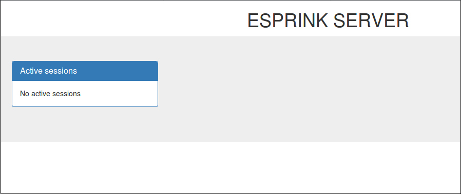

# esprink

File caster server.

To build server you need:
```
git clone
make
```
Start server
```
make run
```
or
```
bin/esprink_server
```
Default HTTP port is 8081. To start server on another port edit esprink.config

To start new session
```
esprink add --help
esprink add <Session> <Filename> <RemoteAddress> <RemotePort> <BPS> [-i <LocalInterface>] [-p <LocalPort>] [-t <MulticastTTL>] [-m MaxChunkSize]
	Add esprink session
	BPS - bytes per second
  MaxChunkSize - max size of the transmitted chunk in bytes
```
So
```
bin/esprink add session1 esprink.png 224.0.0.125 12345 1024
```
will start new session streaming 'example.file' to multicast group 224.0.0.125 to port 12345 sending 1024 bytes per second.

Optionally you can specify -i -p and -t options. Multicast TTL is 1 by default

You can see currently running sessions in your browser:



To start client
```
esprink_client <ServerURL> <SessionId> [-l <LocalAddress>] [-p <LocalPort>] [-L <LostPercentage>]
        LostPercentage - If specified client will simulate packet lost for retransmission mechanism testing. By default 0
```
So
```
esprink/bin/esprink_client http://192.168.1.136:8081 session1
```
will request server 192.168.1.136 for session metadata and start receiving relying on the information received from the server.

Optionally you can specify -l -p and -L options.

Lost percentage flag (-L) allows to simulate transmission losses.

What is supported:

1. Run several streams simultaneously
1. Run different sterams with different BPS and MaxChunkSize options
1. Using the same file in the different streams
1. Fault-tolerant code
1. Console command with command line interface
1. Draft HTTP server for currently running sessions monitoring

What is not yet implemented, but designed for:

1. Release building
1. Logging

NOTES:

I purposely use bytes_per_second instead of bps because of the ambiguity of the latter (bytes_per_second? bits_per_second? bits_per_sample?)
